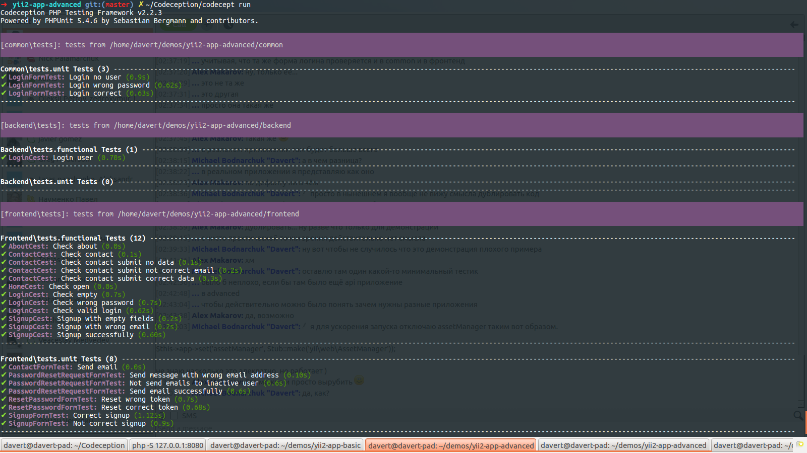

Testing
===============================

Yii2 Advanced Application uses Codeception as its primary test framework. 
There are already some sample tests prepared in `tests` directory of `frontend`, `backend`, and `common`.
In order for the following procedure to work, it is assumed that the application has been initialized using
the `dev` environment. In case tests need to be executed within a `Production` environment, `yii_test` and
`yii_test.bat` must be manually copied from the `environments/dev` folder into the project root directory.
Tests require an **additional database**, which will be cleaned up between tests.
Create database `yiiplus_test` in mysql (according to config in `common/config/test.php`) and execute: 

```
./yii_test migrate
```

Build the test suite:

```
vendor/bin/codecept build
```

Then all sample tests can be started by running:

```
vendor/bin/codecept run
```

You will see output similar to this:



It is recommended to keep your tests up to date. If a class, or functionality is deleted, corresponding tests should be deleted as well.
You should run tests regularly, or better to set up Continuous Integration server for them.  

Please refer to [Yii2 Framework Case Study](http://codeception.com/for/yii) to learn how to configure Codeception for your application.

### Common

Tests for common classes are located in `common/tests`. In this template there are only `unit` tests.
Execute them by running:

```
vendor/bin/codecept run -- -c common
```

`-c` option allows to set path to `codeception.yml` config.

Tests in `unit` test suite (located in `common/tests/unit`) can use Yii framework features: `Yii::$app`, Active Record, fixtures, etc.
This is done because `Yii2` module is enabled in unit tests config: `common/tests/unit.suite.yml`. You can disable it to run tests in complete isolation. 


### Frontend

Frontend tests contain unit tests, functional tests, and acceptance tests.
Execute them by running:

```
vendor/bin/codecept run -- -c frontend
```

Description of test suites:

* `unit` ⇒ classes related to frontend application only.
* `functional` ⇒ application internal requests/responses (without a web server).
* `acceptance` ⇒ web application, user interface and javascript interactions in real browser.

By default acceptance tests are disabled, to run them use:

#### Running Acceptance Tests

To execute acceptance tests do the following:  

1. Rename `frontend/tests/acceptance.suite.yml.example` to `frontend/tests/acceptance.suite.yml` to enable suite configuration

1. Replace `codeception/base` package in `composer.json` with `codeception/codeception` to install full featured
   version of Codeception

1. Update dependencies with Composer 

    ```
    composer update  
    ```

1. Auto-generate new support classes for acceptance tests:

    ```
    vendor/bin/codecept build -- -c frontend
    ```

1. Download [Selenium Server](http://www.seleniumhq.org/download/) and launch it:

    ```
    java -jar ~/selenium-server-standalone-x.xx.x.jar
    ``` 

1. Start web server:

    ```
    php -S 127.0.0.1:8080 -t frontend/web
    ```

1. Now you can run all available tests

   ```
   vendor/bin/codecept run acceptance -- -c frontend
   ```

## Backend

Backend application contain unit and functional test suites. Execute them by running:

```
vendor/bin/codecept run -- -c backend
```
